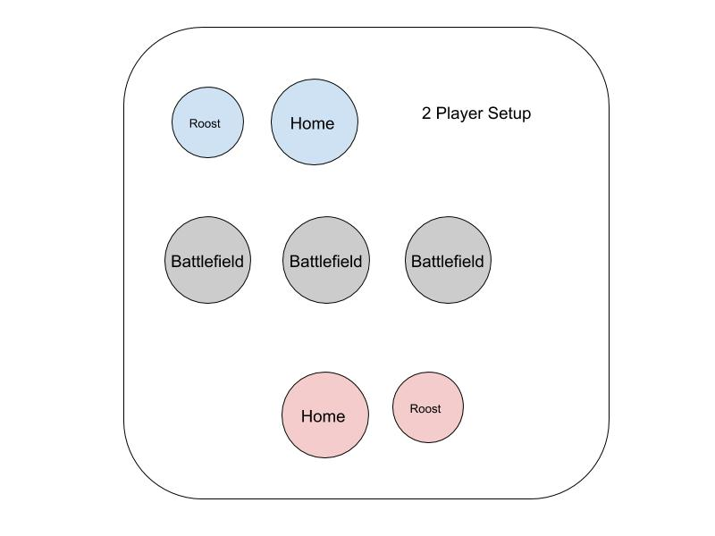
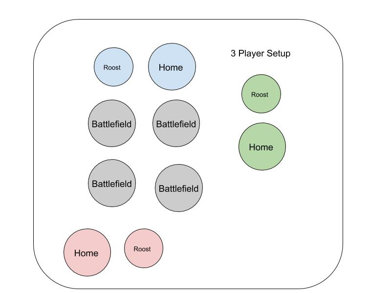

## Heroes of Hedra
Heroes of Hedra is a dice-rolling game meant for quick, head to head competition. Before your next tabletop RPG session, break out your polyhedral dice and try and best your fellow dice owners in a game of luck and skill, all while you wait for that last straggler to show up, or for that bowl of snacks to arrive. Best of all, the basic Heroes of Hedra rules are free!

**Object:** Be the first to score 5 points. Play to 3 or 4 for a quicker game.

**Game Summary:** Players move and roll dice (representing heroes) to win battlefields, earning points by controlling them. Heroes of different types have different special powers.

**Pieces:** 
* 1 set of standard polyhedral dice for each player (one each of d4, d6, d8, d10, percentile d10 (also referred to as d10-0), d12 and d20), in different colored sets for each player
* Extra dice or paper for keeping score
* Differently colored dice, sheets or paper, or tokens to identify the locations of the battlefields, if needed

### Game Setup
Each player places their twenty-sided die (d20) with the number one facing up, off to the side. This is the Dragon Roost, where the Dragon (d20) stays when not in play. They then roll each of their other dice, the four-, six-, eight-, ten-, percentile ten- and twelve-sided dice (d4, d6, d8, d10, d10 with additional 0s (percentile d10 or d10-0), and d12), and place them in their home (a space in front of them). These dice are respectively the Mage (d4), Rogue (d6), Cleric (d8), Warrior (d10), Paladin (percentile d10) and Barbarian (d12), and are referred to as heroes.

**_Board Spaces:_** There are 3 _Battlefields_ in a two player game, represented by 3 spaces in the center of the table. For each additional player beyond two, there is an additional _Battlefield_. Each player also has a _Home_ space directly in front of them and a _Dragon Roost_ next to their _Home_. Below are examples for 2 and 3 players. For 4 players you would have 5 _Battlefields_ and 4 _Homes/Dragon Roosts_.
 

#### Initial Dice Placement
Determine the start player randomly.

Starting with the start player and going clockwise, each player then takes turns assigning their _d6 (Rogue)_, _d8 (Cleric)_, _d10 (Warrior)_ and _d12 (Barbarian)_ (in the order they choose) to a _battlefield_. Dice must be assigned to a _battlefield_ where that player doesn’t already have one, if at all possible (in a 2 player game, each player will have 2 _battlefields_ with 1 die, and 1 _battlefield_ with 2 at the beginning of the game). Once each player has placed their 4 starting dice in _battlefields_, the game begins.

**_Dice terminology:_** When a die is attacking, its face up number is its _Power_. When a die is being attacked (also called _defending_), its face up number is its _Defense_. When incoming _Power_ on a die is greater than its _Defense_, that die is _defeated_. A _defeated_ die is sent to its owner’s _Home_ space (unless it is the _Rogue_ or the _Dragon_). All dice are considered _heroes_ except for the _d20_, which is a _Dragon_ (or is it will be referred to in expanded rules, a _Monster_).

### On Your Turn
Turn Summary:
1. March (move a _hero_)
2. Attack (pick a _battlefield_ to attack and roll dice)
3. Clean up & Scoring (remove _defeated_ dice and get points)
4. Reinforce (move another _hero_)

Here is a description of how to carry out each action on your turn, including special cases caused by the _heroes’_ abilities.

1. March (First Move):
 - You may move a _hero_ from your _home_ to a _battlefield_, or from one _battlefield_ to another. You may also move from a _battlefield_ to your _home_
   - If you moved a _Cleric (d8)_, you may bring an additional _hero_ from its origin to the destination (this can’t be the _Barbarian (d12)_ if enemies were at the starting point)
   - If you moved a _Paladin (percentile d10)_, when they arrive at their destination, you may reroll all of your _dice_ (including the _Dragon_) at that location. This is not an attack
   - If you moved a _Mage_, when they arrive at their destination, you may reroll an enemy _die_ (including the _Dragon_) of your choice at that location
   - The _Barbarian_ can’t be moved if there are enemies wherever it is
   
2. Attack:
 - Select a _Battlefield_ to attack
 - Pick up and roll all your _heroes_ at that _Battlefield_
 - Assign your _heroes_ in a manner of your choice, distributed as evenly as possible amongst your opponents’ _dice_ at that _Battlefield_. For example, if your opponent has 3 dice at a location and you have 5, first assign one die to each of the opponents, and then assign the remaining 2 to 2 of their dice.
 - For each enemy die where the total _Power_ of the dice attacking them is **greater** than their _Defense_, that die is _defeated_. _Defeated_ dice are sent to their owner’s Home space during cleanup (exceptions are the Rogue and Dragon).
   - Example: your opponent has a Rogue (Defense 4) and a Cleric (Defense 5) at a battlefield. You decide to attack here because you have a Warrior, Cleric and Paladin. You get some unlucky rolls and roll a 5 on your Paladin, a 4 on your Warrior and a 2 on your Cleric. You first assign 1 hero to each of your opponents dice. You decide to assign the Paladin to your opponent’s Rogue (it will beat the Rogue 5 to 4), and you assign the Warrior to your opponent’s Cleric. You have your own Cleric to assign now, and you assign it to the enemy Cleric as well (the combined 4+2 will beat your opponent’s 5).

3. Clean up & Scoring:
 - Move all defeated dice where needed
   - Heroes go to the opponent’s home space
   - If defeated, a Dragon returns to its Roost
   - A defeated Rogue may be moved to another battlefield instead of home
   - If a piece is defeated where that player has a Warrior, they may have the Warrior be defeated instead
   - If a Warrior is defeated at a location, it may prevent another piece from being defeated, instead allowing it to move to another battlefield (this includes the Barbarian).
   - For each die that was defeated, that die’s owner advances their Dragon by 5
 - If there are no enemies (including Dragons) left at the space you just attacked and you have dice there, you score 1 point!
 - If a Dragon was defeated in a battle, the player who defeated that Dragon scores a point!
 - For each point that was scored, all players advance their Dragons by 3
 - If a Paladin was defeated and that Paladin’s owner still has dice at that Battlefield, they may reroll all their dice at that field (including the Dragon).
 - If there are any Barbarians remaining at the Battlefield and at least one die was defeated, their owners may reroll them.

4. Reinforce:
 - The player may move a die they didn’t move during the March phase (dice moved by the cleric may be moved again this phase), following all the same rules as before
 
### The Power of Heroes
Each Hero die has unique abilities
**Mage (d4):** The mage is a powerful offensive support hero. When the _Mage arrives at a location, the Mage’s owner may reroll one enemy die there (including the Dragon)_. Furthermore, when the _Mage is attacking, its Power applies to all enemies at that location_, regardless of who the Mage is assigned to.
**Rogue (d6):** The Rogue is not extremely powerful but is very agile. Played well, you may never need to move the Rogue to benefit from their skills. When the _Rogue is defeated, you may have them move to another Battlefield_ instead of the Home space.
**Cleric (d8):** The Cleric supports allies in battle. When you _move the Cleric (either during the March or Reinforce phases), you may move an additional hero with them_ (unless something would restrict that additional movement, such as the Barbarian).
**Warrior (d10):** The Warrior protects their allies. When a friendly die is defeated, you _may sacrifice the Warrior and have them be defeated instead_. Furthermore, when the Warrior is defeated, you may _prevent another friendly die at that location from being defeated that turn. The die saved by the Warrior must retreat to another battlefield_ (this includes a Barbarian where enemies are present
**Paladin (d10-0):** (The Paladin still rolls as a d10 but can be distinguished from the warrior from the extra zeros). The Paladin inspires his allies. When the Paladin _moves to a location, you may reroll all friendly dice (including the Paladin)_ there. This is not an attack. Furthermore, _after the Paladin is defeated, after combat is finished, you may reroll all surviving friendly dice_ there.
**Barbarian (d12):** The Barbarian flies into a frenzy. _When attacking, the Barbarian gains +2 Power for each enemy piece at this Battlefield._ Additionally, if a Barbarian is at a battlefield where _at least one die was defeated, after combat and scoring its owner may reroll it._ This is done after any Paladin rerolls, and if turn order matters, the attacking player goes first and the rest follow in turn order. However, the Barbarian is headstrong, and _cannot be moved away from a battlefield where enemies are present_ unless it is defeated.

### The Dragon
- The Dragon (d20) rests at the Dragon Roost until it is roused to battle. 
- At the start of the game, the Dragon’s die is set to the number one. As events occur (dice are defeated and points are scored), the value on the Dragon’s die advances. Once the Dragon’s die value reaches 20, the Dragon can be unleashed during its owner’s turn, at any point in the turn order. 
- When the Dragon is unleashed, roll the die (this determines its Power) and then assign it to a Battlefield. The Dragon swoops down with fire and fury, and any dice (friendly or enemy) with less Defense than its Power are defeated. These defeated pieces behave as they normally would when defeated. The Dragon then stays at the battlefield until it is defeated, at which point it returns to its Roost. This does not count as an attack and cannot score points. **A Dragon cannot score points on its own.**
- A Dragon on a battlefield does not participate in attacks (they don’t listen to orders well), and is not rolled during attacks nor assigned to enemy dice, but does count as a die that needs to be removed in order to score a battlefield. It can be attacked just like any other die. The Dragon can’t be moved except by the Cleric or Warrior, and it can only be rerolled by Paladins and Mages (Mages might weaken a strong Dragon for a finishing blow).
- While the Dragon is away from the Roost, it does not advance normally, and when it finally goes home to roost, it is reset to 1. It can then continue to advance normally.
- Dragon defeat:  when a dragon is defeated, it returns to its roost and is set to 1. It cannot advance from the defeat of other pieces or the scoring of points from the same battle or event in which it was defeated. That must wait until the next battle (that may be the same turn). When a Dragon is defeated during a battle, whoever defeated it earns 1 point. In essence, you cannot score a point for defeating another Dragon when deploying your own.

### Game End
The game end is triggered once one player reaches 5 points. At this point, continue playing until the player who started the game last takes their last turn. At this time, whoever has the highest score wins. In the case of a tie for score, whoever has the most dice in all battlefields is the winner. If there is still a tie, whoever has the highest advanced Dragon in their Roost wins. If there is still a tie, then the player with the most dice in a single battlefield is the winner. If this does not solve it, then the game is officially a draw.

### Multiplayer Free for All
For free for all rules, increase the number of battlefields as mentioned. In order to score a battlefield, players must still be the only one in a battlefield after their attack. When attacking, players may assign their dice to any enemy dice in their location, and must divide them as evenly as possible, just like before.

### Multiplayer Teams
In a team game, players need only divide their attacking dice amongst enemy players dice at a location, and there only needs to be no enemy dice at a location to score. Only the attacking player earns a point for a successful attack (they still only roll their own dice). In order to win, all players on a team must have at least 3 points, and at least one player must have 5 points.

_MVP:_ If desired, the player who scored the most on the winning team is the MVP, and gains highest honours among the winners

Heroes of Hedra and associated artwork and assets are copyrighted by Grey Spire Games
